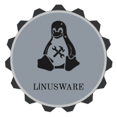

<div align="center">



# LinusWare Executor

**Luau executor for Sober on Linux**


[](#)
[](#)

</div>

---

## About

LinusWare is a high-performance Roblox script executor designed specifically for Linux users running the Sober client. Built with a focus on efficiency and reliability, it features a modern Qt-based interface with advanced process injection capabilities.

## Status

| Component | Status |
|-----------|--------|
| Injection | ✅ Working |
| Lua State Detection | ✅ Working |
| Function Resolution | ❌ Needs Offsets |
| Script Execution | ❌ Blocked |

> **Note:** Script execution is currently blocked because Sober encrypts its binaries. See `docs/EXTREME_DECOMPILING_GUIDE.md` for technical details.

## Features

- **Modern Qt UI** - Professional dark theme with syntax highlighting
- **Multi-method Injection** - Binary injector + GDB fallback
- **Efficient Memory Usage** - ~270MB RAM footprint
- **Pattern Scanner** - Advanced memory scanning for Luau functions
- **SIMD Optimizations** - Assembly-accelerated operations
- **Open/Save Scripts** - Built-in file management
- **Keyboard Shortcuts** - F5 to execute, Ctrl+S to save

## Project Structure

```
linusware-executor/
├── src/
│   ├── core/           # Core injection library
│   │   ├── injected_lib.c
│   │   ├── pattern_scanner.c
│   │   ├── roblox_state.c
│   │   ├── luau_api.h
│   │   └── roblox_offsets.h
│   ├── ui/             # User interfaces
│   │   ├── LinusWareQt.cpp
│   │   └── LinusWareUI.c (legacy)
│   ├── asm/            # Assembly optimizations
│   │   ├── simd_utils.s
│   │   └── heavy_math.s
│   └── Injector.c      # Process injector
├── tools/              # Analysis tools
├── scripts/            # Injection scripts
├── docs/               # Documentation
├── .github/
│   └── assets/         # Logos and images
├── Makefile
├── CMakeLists.txt
└── README.md
```

## Requirements

- **OS**: Linux (Arch, Ubuntu, Debian, Fedora)
- **UI**: Qt5 or Qt6 development libraries
- **Build**: GCC/G++, CMake 3.16+
- **Target**: Sober (Flatpak Roblox client)

## Installation

### Install Dependencies

```bash
# Arch Linux
sudo pacman -S qt6-base cmake gcc make

# Ubuntu/Debian  
sudo apt install qt6-base-dev cmake g++ make

# Fedora
sudo dnf install qt6-qtbase-devel cmake gcc-c++ make
```

### Build & Run

```bash
make        # Build all components
make run    # Launch LinusWare UI
make inject # Direct injection into Sober
make logs   # View debug logs
make clean  # Clean build artifacts
```

## Usage

1. **Launch Sober** and join a Roblox game
2. **Start LinusWare**: `make run` or `./linusware`
3. **Click INJECT** button
4. **Wait for "Connected" status**
5. **Write your Lua script** in the editor
6. **Press F5 or click EXECUTE**

## Keyboard Shortcuts

- `F5` - Execute script
- `Ctrl+S` - Save script
- `Ctrl+O` - Open script

## Troubleshooting

### "Library not found"
Ensure `linusware_exec.so` is built:
```bash
make linusware_exec.so
```

### "Offsets not configured"
The Luau function offsets need to be discovered via reverse engineering.  
See `docs/EXTREME_DECOMPILING_GUIDE.md` for the complete workflow.

### Qt build fails
Check your Qt installation:
```bash
qmake --version  # Should show Qt 5.15+ or Qt 6.x
```

## Architecture

LinusWare uses a multi-stage injection process:

1. **Binary Injector** - Fast ptrace-based injection
2. **GDB Fallback** - Alternative method using dlopen
3. **Memory Scanner** - Pattern-based function discovery
4. **Lua State Detection** - Heuristic-based VM location
5. **IPC Communication** - File-based script execution

## Development

### Debug Logs

```bash
# Real-time log monitoring
make logs

# Or manually
tail -f /tmp/linusware_debug.log
```

### Contributing

Please read `docs/CONTRIBUTING.md` before submitting pull requests.

## License

Copyright © 2026 [compiledkernel-idk](https://github.com/compiledkernel-idk)  
All Rights Reserved. Proprietary Software.

## Disclaimer

This software is for educational purposes only. Use at your own risk.

---

<div align="center">
Made with ♥ for the Linux community
</div>
